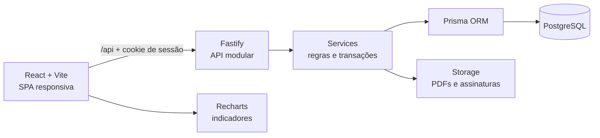

<div align="center">

# Jamval App

### Da conferência em papel ao controle completo da operação de consignação

Sistema full stack para gerenciar visitas, vendas, recebimentos, comprovantes e estoque
de uma pequena distribuidora familiar de acessórios eletrônicos.

<p>
  
  
  
  
  
  
</p>

</div>

## Demonstração online

| | |
| --- | --- |
| **Aplicação** | <a href="https://jamval-frontend.vercel.app/" target="_blank" rel="noopener noreferrer">Acessar a demo do Jamval App</a> |
| **E-mail** | `teste@gmail.com` |
| **Senha** | `#Borabill67` |

> O sistema foi projetado para uma operação de usuário único e não possui cadastro
> público. As credenciais acima pertencem exclusivamente ao ambiente de demonstração.


> **Status:** desenvolvimento avançado. O fluxo principal está disponível na demo e
> passa por ajustes finais de usabilidade antes da adoção diária na operação real.

## Visão geral

O **Jamval App** nasceu de um problema real da empresa do meu pai. A Jamval distribui
cabos, carregadores, fones e outros acessórios para lojas parceiras, principalmente por
consignação. A conferência era feita com folhas impressas, comparação manual com a
visita anterior e cálculos na frente do cliente.

A aplicação digitaliza esse processo de ponta a ponta: mantém a base de produtos em
cada loja, calcula o que foi vendido, registra pagamentos totais ou parciais, atualiza
o estoque, gera comprovantes em PDF e organiza as próximas visitas.

<table>
  <tr>
    <td align="center"><strong>🏪 Consignação</strong><br />Base anterior e reposição</td>
    <td align="center"><strong>💰 Financeiro</strong><br />Pagamentos e recebíveis</td>
    <td align="center"><strong>📦 Estoque</strong><br />Custos e movimentações</td>
    <td align="center"><strong>🧾 Comprovantes</strong><br />PDF e assinatura</td>
  </tr>
</table>

## Problema e solução

| Antes | Com o Jamval App |
| --- | --- |
| Conferência produto a produto em papel | Base anterior do cliente carregada automaticamente |
| Cálculo manual das unidades vendidas | Venda calculada a partir de saldo, trocas, perdas e reposição |
| Pagamentos pendentes anotados separadamente | Contas a receber com saldo e histórico de pagamentos |
| Estoque atualizado depois da visita | Movimentações geradas ao concluir o atendimento |
| Comprovante preenchido manualmente | PDF gerado com dados da visita, valores e assinatura |
| Retornos dependentes de memória ou agenda informal | Fila operacional com clientes a visitar novamente |

## Produto em ação

### Visitas e consignação

<table>
  <tr>
    <td width="50%" align="center">
      
      <br /><strong>Conferência da base anterior</strong>
    </td>
    <td width="50%" align="center">
      
      <br /><strong>Reposição e nova base do cliente</strong>
    </td>
  </tr>
</table>

### Financeiro

<table>
  <tr>
    <td width="50%" align="center">
      
      <br /><strong>Carteira de recebíveis</strong>
    </td>
    <td width="50%" align="center">
      
      <br /><strong>Pagamentos e saldo restante</strong>
    </td>
  </tr>
</table>

### Estoque

<table>
  <tr>
    <td width="50%" align="center">
      
      <br /><strong>Saldos e alertas de estoque</strong>
    </td>
    <td width="50%" align="center">
      
      <br /><strong>Movimentações e custo de entrada</strong>
    </td>
  </tr>
</table>

### Comprovantes e gestão

<table>
  <tr>
    <td width="50%" align="center">
      
      <br /><strong>Histórico de comprovantes</strong>
    </td>
    <td width="50%" align="center">
      
      <br /><strong>Documento em PDF</strong>
    </td>
  </tr>
</table>


## Fluxo operacional

1. Produtos, clientes e o catálogo específico de cada cliente são cadastrados.
2. O estoque central recebe a carga inicial e novas entradas com custo de compra.
3. Uma visita é aberta como **consignação** ou **venda direta**.
4. Na consignação, o sistema carrega a base anterior e registra vendas, trocas, perdas
   e unidades restantes.
5. O valor do acerto é calculado e o pagamento recebido na hora é informado.
6. A reposição define a nova base que ficará no cliente para a próxima visita.
7. A conclusão atualiza estoque e financeiro dentro do mesmo fluxo de negócio.
8. Eventuais saldos viram contas a receber e o comprovante fica disponível em PDF.
9. A fila operacional destaca os clientes que precisam de um novo atendimento.

## Arquitetura



O backend organiza cada área em rotas, controller, service, repository, schemas e
tipos. Essa separação mantém as validações HTTP próximas da entrada e concentra regras
como conclusão de visita, movimentação de estoque e criação de recebíveis nos services.

```text
route → controller → service → repository → Prisma → PostgreSQL
```

## Funcionalidades

### Operação e visitas

- Dashboard inicial com fila de retorno, visitas abertas e histórico recente.
- Visitas de consignação e venda direta.
- Bloqueio de mais de uma visita aberta para o mesmo cliente.
- Cálculo automático de vendidos, trocas, perdas, restante e reposição.
- Busca rápida e subtotal por item na venda direta.
- Histórico concluído somente para leitura.

### Financeiro

- Registro do valor recebido no fechamento da visita.
- Criação automática de recebível quando existe saldo pendente.
- Filtros por situação pendente, parcial ou quitada.
- Histórico de pagamentos com forma, referência e observações.
- Validação para impedir pagamentos acima do saldo atual.

### Estoque

- Estoque central por produto e carga inicial da operação.
- Entradas com quantidade e custo unitário real.
- Ajustes positivos ou negativos para correções.
- Histórico filtrável de movimentações.
- Saídas automáticas por reposição e venda direta.
- Alertas de saldo baixo ou zerado.

### Comprovantes e administração

- PDFs específicos para venda direta e acerto de consignação.
- Dados de empresa, cliente, itens, valores, pagamento e assinatura.
- Dashboard financeiro com filtro de período e comparativo vendido x recebido.
- Ritmo de visitas, carteira por situação e visão de lucro bruto.
- Ranking de produtos, alertas de custo/estoque e maiores pendências.
- Configuração dos dados da empresa utilizados nos documentos.

## Decisões técnicas

- **Transações no fechamento:** os efeitos em visita, estoque, pagamentos e recebíveis
  são coordenados pelo backend para evitar atualizações parciais.
- **Dinheiro e histórico:** o domínio preserva valores, custos e movimentações para
  permitir conferência posterior e cálculo de indicadores.
- **Autenticação:** acesso protegido por sessão em cookie e senha com hash Bcrypt.
- **Validação em duas pontas:** React Hook Form e Zod no frontend; schemas Zod na API.
- **Comprovantes reproduzíveis:** PDFs são gerados no backend e o conteúdo final pode
  ser armazenado junto ao registro da operação.
- **Deploy same-origin:** o frontend encaminha `/api` ao backend, mantendo o fluxo de
  sessão transparente tanto localmente quanto na Vercel.

## Stack

| Camada | Tecnologias |
| --- | --- |
| **Frontend** | React 19, TypeScript, Vite 7, Tailwind CSS 4, React Router 7, TanStack Query, React Hook Form, Zod, Recharts |
| **Backend** | Node.js, Fastify 5, TypeScript, Prisma ORM 6, Zod, PDFKit, Bcrypt |
| **Dados** | PostgreSQL, migrations e seed Prisma |
| **Infraestrutura** | npm workspaces, Docker Compose, Supabase e Vercel |

## Rotas principais

| Área | Rotas |
| --- | --- |
| Acesso e operação | `/login`, `/`, `/visits`, `/visits/new`, `/visits/:visitId` |
| Financeiro | `/financeiro`, `/financeiro/:receivableId` |
| Estoque | `/stock`, `/stock/initial-load`, `/stock/manual-entry`, `/stock/manual-adjustment` |
| Cadastros | `/products`, `/clients`, `/clients/:clientId/catalog` |
| Comprovantes | `/receipts` |
| Administração | `/admin/dashboard`, `/admin/indicadores`, `/admin/lucro`, `/admin/configuracoes` |

## Estrutura do projeto

```text
.
├── backend/
│   ├── prisma/          # Schema, migrations e seed
│   └── src/modules/     # Auth, clientes, visitas, estoque, financeiro e recibos
├── frontend/
│   ├── api/             # Proxy serverless para o backend
│   └── src/features/    # Telas organizadas por domínio
├── storage/             # Comprovantes e assinaturas no ambiente local
├── docker-compose.yml   # Ambiente principal
└── package.json         # Scripts e npm workspaces
```

## Como executar localmente

### Com Docker Compose

```bash
# Na raiz do projeto
cp .env.example .env
docker compose up --build
```

O Compose aplica as migrations e inicia PostgreSQL, backend e frontend.

| Serviço | Endereço |
| --- | --- |
| Frontend | `http://localhost:5173` |
| Backend | `http://localhost:3333` |
| PostgreSQL | `localhost:5432` |

Para carregar uma base fictícia completa:

```bash
npm run prisma:seed:docker
```

O seed recria produtos, clientes, catálogos, estoque, movimentações, visitas, pagamentos
e contas a receber. Use esse comando somente em ambiente local ou de desenvolvimento.

### Sem Docker

```bash
npm install
cp backend/.env.example backend/.env
cp frontend/.env.example frontend/.env
npm run prisma:generate
npm run dev
```

Para aplicar as migrations e carregar os dados de desenvolvimento:

```bash
npm run prisma:migrate:dev --workspace backend
npm run prisma:seed
```

Para criar ou atualizar um administrador:

```bash
npm run admin:create -- --name "Murilo Pereira" --email "admin@jamval.local" --password "sua-senha"
```

<details>
<summary><strong>Compartilhar o ambiente local temporariamente</strong></summary>

Com a aplicação em execução, abra outro terminal e rode:

```bash
npm run tunnel:temp
```

O Cloudflare Tunnel exibirá uma URL temporária `https://<nome>.trycloudflare.com` e
encaminhará as requisições de `/api` para o backend local. A URL deixa de funcionar ao
encerrar o comando. O `cloudflared` precisa estar instalado no sistema.

</details>

## Validação do projeto

```bash
# Compila backend e frontend
npm run build

# Verifica o frontend com ESLint
npm run lint:frontend
```

## Competências demonstradas

- Levantamento de uma necessidade real e transformação em produto digital.
- Modelagem de clientes, catálogos, visitas, estoque, pagamentos e recebíveis.
- Desenvolvimento full stack com TypeScript no frontend e backend.
- Fluxos guiados para reduzir erros durante o atendimento em campo.
- Regras transacionais com efeitos coordenados em estoque e financeiro.
- Geração e persistência de documentos PDF.
- Dashboards financeiros e operacionais com filtros e indicadores.
- Deploy full stack com banco gerenciado e proxy serverless.
- Organização modular por domínio e ambiente reproduzível com Docker.

## Autor

Desenvolvido por **Murilo Pereira Macedo**, estudante de Análise e Desenvolvimento de
Sistemas.

O projeto foi criado para resolver uma necessidade real da Jamval e servir como case
prático de produto e engenharia no meu portfólio. Ferramentas de inteligência artificial
foram utilizadas como apoio para estudo, experimentação e revisão; a modelagem do
problema, o fluxo do produto e as decisões de implementação foram conduzidos por mim.
